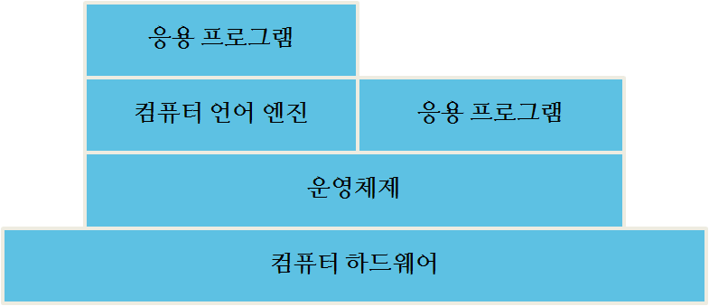
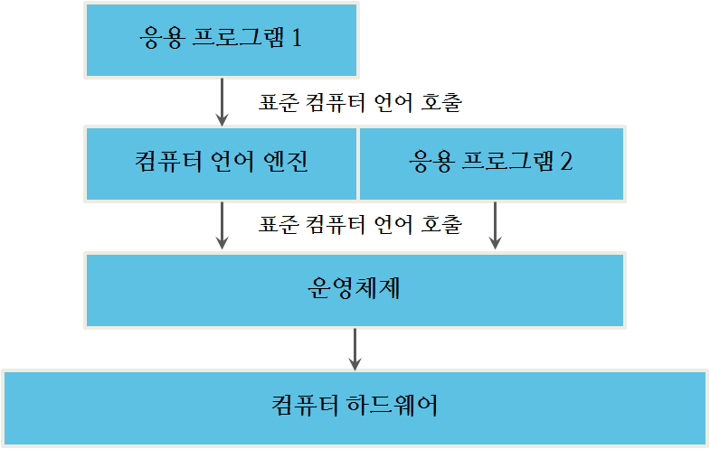
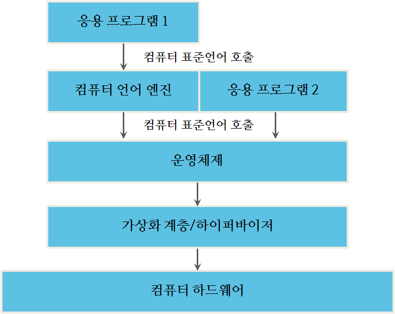
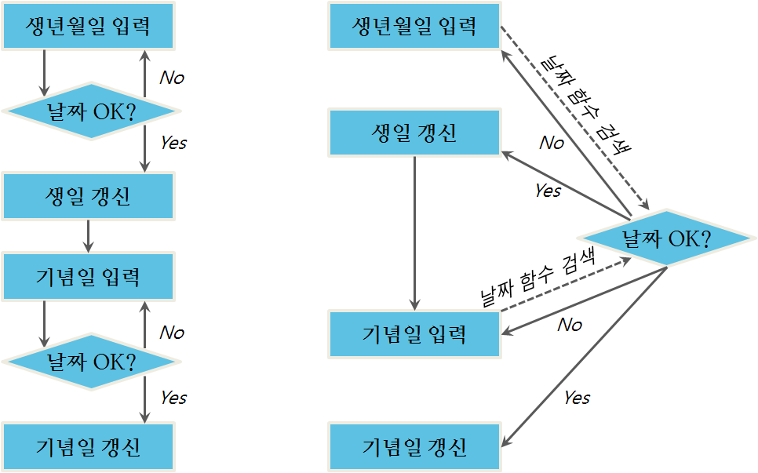

컴퓨터 엔지니어가 아니고 오픈소스 라이선스 사용허가권을 이해하는데 유용한 개념을 잡으려고 하는 독자를 위한 과외학습내용이 나와 있다.

### 오픈 소스의 "소스"가 무엇인가?

요즘 언론에 따르면 적어도 모든 것이 오픈 소스(Open Source)다 - 몇가지 사례를 들면, 교과서, 요가, 윤월절(seders), 농사 씨앗, 데이터베이스, 곤충 농장 조립용품 세트. 이 모든 것들이 "오픈(Open)"되었지만, 정말 어떤 소스코드(source code)도 없다. 왜 오픈소스가 중요한지 이해하기 위해서는, 먼저 소스코드(bug farm kit)가 무엇인지 이해해야만 된다.

오늘날 대부분의 컴퓨터 사용자는 (a) iOS 혹은 안드로이스 시스템을 탑재한 모바일 기기를 사용하거나 (b) 윈도우즈 운영체제를 탑재한 데스크톱 혹은 노트북 컴퓨터를 사용한다. 모바일 기기나 컴퓨터에 있는 프로그램을 실행할 때 (*앱(App)*, 응용프로그램), 프로그램을 구성하는 전자파일을 *실행가능한 파일(executable file)*이라고 부른다. 본인 컴퓨터에 다른 것과 마찬가지로 파일이지만, 컴퓨터가 실행할 수 있는 형식(format)으로 되어 있다. 윈도우즈 데스크톱 시스템에서, 이러한 파일은 파일 확장자로 "실행가능(executable)"을 뜻하는 `.exe`를 갖는다. (모바일 플랫폼에서는 이런 파일을 전혀 볼 수 없지만, 응용프로그램 각각이 실행가능한 파일이다.)

컴퓨터는 복잡한 연산작업을 중앙처리장치 혹은 그래픽 처리장치가 초당 수십억번 수행할 수 있는 매우 작은 단계로 연산작업을 쪼개서 수행한다. 1 바이트를 4바이트로 기억장치 특정 장소에서 다른 장소로 이동, 단순한 사칙연산 수행, 실행할 다음 단계를 선택하는 작업(디폴트 기본설정 혹은 테스트 결과에 따라)이 이러한 연산작업에 포함된다. 각 연산작업은 매우 단순하지만, 아주 많은 연산작업을 수행함으로써, 컴퓨터는 사람이 인지할 수 있는 행동을 취할 수 있다 - 예를 들어, 화면에 메시지 출력. 컴퓨터가 이해할 수 있는 단순한 명령은 너무 작은 조각이라 사람이 쉽게 이해하고 조직화할 수 없다. 그래서, 컴퓨터 과학자가 컴퓨터 프로그램을 작성하는데 사용되는 컴퓨터 언어를 개발해서 사람이 더 쉽게 처리할 수 있게 했다. 이것이 소위 프로그래밍 언어(Programming Language)다. 프로그래밍 언어 각 문장이 많은 컴퓨터 명령으로 번역된다.

사람이 프로그램을 *소스코드*로 표현한다. 컴퓨터는 소스코드를 *컴파일(Compilation)*과 *해석(interpretation)*으로 불리는 과정을 거쳐 실행될 수 있는 무언가로 번역한다. 예를 들어, 대부분의 C 프로그램은 CPU로 직접 실행될 수 있는 이진코드로 컴파일된다. 자바와 마이크로소프트 C#으로 작성된 프로그램은 *바이트 코드(byte code)*로 불리는 중간 이진표현으로 번역되고, *가상 컴퓨터(Virtual Machine)*으로 불리는 컴퓨터 프로그램에 의해서 실행되는 이진코드로 전환된다. 

C와 자바같은 많은 프로그래밍 언어는 소스코드 형태와 실행가능 형태를 갖고 있다. 소스코드 형태는 실행가능하지 않다. 컴퓨터가 실행할 수 없다는 의미다. 실행가능 형태는 사람이 읽을 수가 없다 - 본질적으로 수많은 0과 1로 구성되어 있고, 종종 *목적 형태(object form)*라고도 불린다.

소프트웨어를 작성하는데 컴퓨터 언어 프로그래머가 소스코드를 사용한다. 소스코드는 거의 [자연어][1]처럼 생겼다. 다음에 예제가 있다.

~~~ {.input}
#include <stdio.h>
int main(void)
  {
    int x; 
    x=1;
    if (x==1) {printf ("I am the One.\n")};
    return 0;
  }
~~~

상기 언어가 프로그래머가 아닌 일반인에게 이상하게 보일 수도 있지만, 일부는 친숙해야 된다. 컴퓨터 언어는 *include* 혹은 *print* 같은 동사, *x* 같은 명사, *int* (integer 정수를 나타냄) 같은 형용사를 갖고 있다. 프로그래머가 사용하고자 하는 코드를 작성하고 나서, 텍스트로 파일을 저장한다. 그리고 나서 *컴파일러(compiler)*라고 불리는 프로그램을 실행한다. 컴파일러는 텍스트파일을 소스코드로 처리하고 소스코드를 목적코드(object code)로 번역한다. 코드가 목적 형태로 되면, 소스코드로 되돌아 가지 않고는 변경될 수 없다. 이론적으로 코드를 "역컴파일(decompile)"할 수 있지만, 과정이 그다지 신뢰성이 있지 않고, 어떤 상황에서도 역컴파일된 코드는 소스코드를 좀더 읽기 좋게 만드는 주석이 포함되어 있지 않다. 사실 역컴파일에 관한 진실은 복잡하다: 자바같은 일부 언어는 믿음직스럽게 역컴파일되는 반면에 C 같은 다른 언어는 그렇지 못하다; 그리고 역컴파일러는 매년 정확성이 높아지고 정교화되고 있다. 

컴퓨터가 더 느렸을 때, 프로그램을 소스코드에서 실행가능 형태로 전환하는 시간은 측정가능했고, 사용자의 프로그램 사용을 방해하거나 늦췄다. 지난 20년에 걸쳐서, CPU는 훨씬 빨라졌다. 처리가 더 빨라짐에 따라, 더 많은 연산작업이 메인 프로그램에서 라이브러리로 옮겨졌다. 예를 들어, 애플 II 시절에  개발자가 코드를 작성하려고 하면 이미지를 화면 주위로 옮겨야 했다. 오늘날, 소스코드 한줄로 웹브라우져에서 이미지 애니메이션 기능을 구현하는 방법은 수도 없이 많다.

    [1]: (컴퓨터 언어에 반대되어) 자연어로 사람이 사용하는 언어다; 영어와 한국어가 좋은 사례다.

이와 같은 발전으로, 코드가 점차 소스코드 형태로 배포된다. 예를 들어, 웹브라우져에 HTML과 자바스크립트를 적재되면, 웹브라우져가 웹페이지를 화면에 출력하고, 입력값을 검사하고, 페이지 콘텐츠에 애니메이션할 수 있는 실행가능한 코드로 HTML과 자바스크립트를 변환한다. 오늘날 일반적인 웹페이지는 20년 전 컴퓨터 전체 메모리에 넣을 수는 것보다 많은 코드를 담고 있다.

인터넷으로 코드를 전송하는데 소요되는 시간을 줄이고자, 프로그래머가 코드를 더 작게 압축한다. 이렇게 압축된 코드는 기술적으로 중간 형태가 아닐 수도 있지만, 원시 소스코드와 다르게 보인다. 따라서, 웹브라우져 내부에서 실행되는 (이점에 대해서 아래를 좀더 참조) 자바스크립트는 흔히 모든 화이트스페이스(white space)를 삭제하도록 변형된다. 프로그래밍에서, 공백과 탭 같은 *화이트스페이스*는 일반적으로 기능이 없고 단지 가독성을 높이기 위해서 사용된다. 따라서 화이트스페이스를 삭제하게 되면 기능적으로 동일한 읽기에 매우 촘촘한 소스코드가 된다. 따라서, 상기 예제코드는 다음과 같이 다시 작성될 수 있다:

~~~ {.input}
#include <stdio.h>
int main(void){int x;x=1;if(x==1){printf("I am the 
One.\n")};return 0;}
~~~

상기 코드는 앞선 예제와 같지만 화이트스페이스 대부분이 제거되었다. 자바스크립트 같은 스크립팅 언어에 대해, 화이트스페이스를 제거하면 소스코드에 문자 숫자를 줄여서 사용자 웹브라우져에서 실행되는 코드를 다운로드하는 시간을 높일 수 있다. (모바일 핸드폰 기기처럼) 작은 파이프를 경유하여 전달되어야 되는 복잡한 웹 응용 프로그램을 작성하려는 프로그래머에 있어서 속도와 관련된 모든 비트가 도움이 된다.

### 빌딩, 링킹, 패키징

실무에서, 대부분의 코드는 상기 예제에 나와 있는 것보다 훨씬 더 복잡하다. 프로그래밍 현실세계에서 위에서 작성한 작은 예제는 그다지 유용하지 않다. 하지만, 만약 작은 프로그램을 적절하게 잘 엮으면 작은 코드 덩어리가 매우 유용할 수 있다. 예를 들어, 숫자를 더하거나 제곱근을 구하는 코드 한 토막(code snippet)이 매우 중요할 수도 있다. 하지만, 현실 세계에서 어떤 프로그램 반복해서 해당 코드를 사용할 필요가 있을 수 있고, 프로그래머는 한번만 코드를 작성하고자 한다. 이곳이 빌딩(building)과 패키징(packaging) 개념이 들어서는 입구가 된다.

 물론, 오늘날 거의 어떤 프로그래머도 제곱근을 찾아내는 루틴(routine)을 작성하고 싶지 않는데 이유는 이미 누군가 그런 루틴을 작성했기 때문이다. 그래서, 현실 세계에서 프로그래머로 하여금 기존에 존재하던 루틴을 재사용해서 프로그램을 빌드해서 만들어내는 기법이 있다. 기존에 존재하던 제곱근 루틴은 이미 테스트되어 검증되었고, 따라서 맨땅에서 새로 개발된 것보다 신뢰성이 더 높다. 이렇게 기존에 존재하는 코드 루틴을 흔히 *라이브러리(library)*라고 부른다. 라이브러리는 법률서류(legal restatement)와 유사하다. 마치 변호사가 기본 판례를 지칭하기보다 법률서류에 있는 특정 부분을 참조하듯이, 프로그래머는 라이브러리 루틴을 사용해서 잘 정의된 일반적인 연산작업을 수행한다.
 
프로그래머가 프로그램을 만들때, 먼저 소스코드 형태로 코드를 작성하고 컴파일해서 목적코드형태로 전환시킨다. 그리고 나서, *링커(linker)*로 불리는 프로그램을 사용해서 작성한 목적코드를 라이브러리 루틴의 다른 목적코드와 연결시킨다. 만약 이 작업을 수행되면, 프로그래머는 굳이 라이브러리 소스코드가 필요하지 않다. 잘 작성된 라이브러리는 대체로 프로그래머에 대해 *블랙박스(black box)*다. 즉, 프로그래머는 블랙박스 안으로 들어가는 것과 나오는 것(코드를 엮는데 필요한 정보)을 제외하고 박스내부에 무엇이 있는지 알 필요가 없다. 이 정보를 *인터페이스 정의(interface definition)* 혹은 [응용프로그래밍 인터페이스 (API, Application Program Interface)][2]라고 부른다.

    [2]: 사람들이 *API* 용어를 사용해서 다양한 것을 의미한다. 하지만, (정중하게 제시된) 이 사용법이 가장 정확한 의미가 된다. 코드 라이브러리를 의미하는데 *API*를 사용하는 것은 정확하지 않지만, 불행히도 일반적이다.

목적코드가 모두 엮기게 되면, 이것을 *실행가능 프로그램(executable program)*이라고 부른다. 실행가능 프로그램은 실행하는데 필요한 모든 조각을 갖추고 있다.

프로그래머가 라이브러리 루틴에 버그를 발견하거나 작성한 코드가 동작하지 않는 사용사례(Use Case)를 가정해보자. 예를 들어, 라이브러리가 율리우스 달력에 나온 날짜를 선택했지만, 프로그래머는 음력에 나온 날짜를 선택했다고 가정하자. 라이브러리가 프로그래머가 의도한대로 동작하지 않아서 고치려면 소스코드에 접근할 필요가 있다. 이것은 컴파일링이 일방통행이기 때문이다 - 컴파일된 코드 변경이 가능하지 않다. 만약 프로그래머가 코드에 변경을 하려면, 소스코드로 되돌아가서, 수정을 하고, 코드를 재컴파일하고, 프로그램을 다시 링크하여 연결한다.

이 책을 읽는 변호사는 차별제공 프로그램(Redlining program)을 생각해볼 수 있다. 차별제공 프로그램은 *일괄처리 방식(batch mode)*으로 작동한다-사용자가 프로그램을 착수시키면, 사용자 상호작용없이 동작한다. 만약 차별제공을 변경하려면, 원래 파일로 되돌아가서, 변경하고, 차별제공-일괄처리 프로그램을 다시 실행한다. 컴퓨터 소스코드도 방식이 동일하다. 이것이 왜 소스코드에 대한 접근이 중요한지에 대한 이유가 된다. 

소스코드 없이 버그 수정을 할 수 없다. 소스코드 없이 변경 혹은 개선을 할 수 없다. 목적코드로 할 수 있는 전부는 좀더 큰 프로그램에 넣어 만드는 것 뿐이고, 실행가능 파일을 가지고 할 수 있는 모든 것은 실행하는 것 뿐이다.

### 자바스크립트

자바스크립트 언어는 이 자체로 한 절을 온전히 차지할 가치가 있는데 이유는 현대적인 웹개발에 매우 중요하고, 몇가지 이유로 프로그래머가 아닌 사람에게 상당한 혼란을 불러일으키기 때문이다. 먼저, 자바스크립트는 자바가 아니다. 자바는 프로그래밍 언어(컴파일 언어)로 웹배포에 있어 매우 대중적인 언어다. 반면에, 자바스크립트는 스크립팅 언어로 (컴파일되지 않은 형태) 웹브라우져 내부에서 프로그램을 실행한다. 전자상거래 판매자로부터 신발 한 켤레를 주문하고 배송지 주소를 채워넣는다고 상상해보자. 입력값을 검사하고, 필수값을 입력하게 강제하고, 따르지 않으면 웹페이지와 상호작용하는 방식을 안내하는 코드는 아마도 자바스크립트로 작성되었을 것이다.

자바스크립트에 관해서 이해할 중요한 점은 HTML처럼 사용자 브라우져에 소스코드 형태로 전달되고, 사용자 컴퓨터에서 실행된다는 점이다. 이러한 특징이 오픈소스 라이선싱 사용허가에 있어 매우 큰 차이를 만들게 된다.

### 펄, 파이썬, PHP, 기타 스크립팅 언어

펄(PERL), 파이썬(Python), PHP 같이 흔히 사용되는 인기있는 스크립팅 언어가 있다. *스크립팅 언어(Scripting Language)*는 고수준 언어로 적은 코드양을 갖고 상당한 작업을 수행할 수 있음을 의미한다. 스크립팅 언어는 소스코드 형식으로 실행되고 대체로 *해석기(interpreter)*, 가상기계, 언어엔지 위에서 돌아간다. 스크립트를 돌리기 위해서, 해석기가 사용자 시스템에 설치될 필요가 있다. 해석기는 스크립트를 처리하는 방법을 알고 있다. 

### 컴퓨팅 계층

동시대 컴퓨터 처리가 많은 계층에서 일어난다. 이 점에 있어서, 지난 20~30년에 걸쳐 컴퓨팅은 엄청나게 변했다. 옛날에는 프로그래머 한명이 단일 프로세서에서 돌아가는 프로그램을 하나 작성했다. 그 시절에, 모든 비트의 기능이 컴퓨터 프로세서의 희귀 시간과 공간 자원을 차지해서 구현되었다. 오늘날, 프로세서는 더 커지고 더 빨라졌고, 많은 프로그램을 한번에 처리할 수 있다. 그래서 컴퓨팅이 더 모듈화 되었다.

가정과 사무실에 비치된 데스크톱 컴퓨터처럼 오늘날 컴퓨터 시스템은 그림 2.1 처럼 생겼다.

운영체제가 컴퓨터 "교통경찰" 역할을 자임하고 있다. 운영체제는 어느 프로그램을 실행할지, 어느 프로그램이 실행되고 있는지 추적하고, 프로그램 사이에 우선순위를 부여하고, 프로그램과 현실세계(키보드, 컴퓨터 화면, 프린터 처럼) 사이를 중재한다.

그림 2.1 컴퓨터 시스템 아키텍쳐

오픈소스 소프트웨어 라이선싱의 어떤 면은 구성요소가 상호작용하는 방식에 달려있다. 그림 2.2 를 좀더 세밀히 살펴보자. 구성요소가 의사소통하는 방법이 중요할 수 있다. 예를 들어, 단지 운영체제만 하드웨와 "대화"하는 것을 볼 수 있다. 이것이 일반적인 접근방법인데 이유는 의사소통 수단(하드웨어와 하드웨어가 의사소통하는 방식)이 특정 물리적 컴퓨터마다 다양하기 때문이다. 따라서, 운영체제은 특정 하드웨어 플랫폼에 동작되도록 제작되어야 된다. 하지만, 응용프로그램 2 개발자는 모든 컴퓨터에서 돌아가도록 다른 버젼의 응용프로그램을 작성하고 싶지 않다고 가정하자. 대신에, 개발자는 가장 적은 버젼의 응용프로그램을 작성하면서도 많은 컴퓨팅 사용자 고객에 다가갈 수 있다. 개발자는 이러한 목표를 *추상화(abstraction)*라는 개념을 사용해서 달성하는데, 이 개념이 현대 컴퓨팅에 있어 핵심이다. 만약 운영체제(예를 들어, 윈도우즈, 리눅스, iOS) 설계자가 운영체제 명세서나 운영체제를 사용하는 필요한 API를 제공하고 나면, 개발자는 해당 플랫폼에 대해 프로그램을 한번만 작성하면 된다. 이를 위해서, 운영체제 공급업체는 표준 시스템 호출 집합을 사용하거나 해당 운영체제에 대한 API를 사용한다. 예를 들어, 모니터 화면에 그래픽을 표시하는 API, 파일을 프린터로 전송하는 API, 키보드에서 입력을 얻는 API가 운영체제 API에 포함될 수 있다. 만약 프로그래머가 해당 API에 대한 구문과 규칙을 따른다면, 그렇게 작성된 프로그램은 해당 API를 사용하는 어떤 운영체제에서도 돌아간다.

추상계층을 생성하는 방식은 표준화뿐만 아니라 보안도 증진시킨다. 응용프로그램 프로그래머는 다른 프로그램에서 사용하는 메모리를 덮어 쓴다거나, 화면에 맞지 않는 그림을 그리도록 명령을 전송하는 등 오래전에 했던 것을 하지말아야 된다. 프로그램이 동작하는 범위와 권한을 줄이는 것을 때때로 *캡슐화(Encapsulation)*라고 부른다. 캡슐화는 프로그램이 특정 운영체제와 호환이 되도록 명확히 규정하고, 기술적인 문제를 일으키지 않고 프로그램이 수행할 수 있는 것에 대한 한계도 정의한다.

이러한 계층이 근본적으로 제멋대로라는 것을 이해하는 것이 중요하다 - 이런 계층은 운영 시스템 공급업체에 의해서 변경되거나 새롭게 정의될 수 있다. 그러나, 모든 사람이 사용하지 않는다면, 표준화는 실패한다. 그래서 사실 운영체제 같은 표준 컴퓨팅 플랫폼을 위한 API를 변경하는 것은 느리다. 예를 들어, 리눅스 API는 1970년대 벨연구소에서 개발된 UNIX API에서 가져왔고, 안드로이드는 리눅스에서 돌고, iOS는 BSD라고 불리는 또다른 유닉스 변종에서 돌아간다. 하지만 리눅스, 안드로이드, iOS 개발자에 사용가능한 API는 본질적으로 유사하고 수십년된 공통된 뿌리에서 진화했다. 

운영체제 바로 위 대신에 언어 플랫폼 위에서 돌아가는 응용 프로그램이 상기 그림에 포함된 것을 아마도 알아챘을 것이다. 이것이 추가 추상계층을 제공해서 두가지 작업을 수행한다. 먼저, 언어에 대한 API가 많은 운영체제에 걸쳐서 일관성이 있다면, 좀더 표준화 기능을 제공한다. 예를 들어, 자바 언어 모토는 "일단 프로그램을 작성하면, 어떤 플렛폼에서도 실행된다"(Write Once, Run Everywhere). 자바는 매우 대중적인 언어 플랫폼이고, 여러분은 아마도 인식하지 못하고 사용했을 것인데 이유는 대부분의 데스크톱과 노트북 컴퓨터에 설치되어 있고, 많은 웹기반 프로그램도 실행하기 때문이다. GPL 같은 카피레프트 라이선스 준수를 위한 구체적인 사항을 다룰 때, 이러한 개념은 매우 중요하다. 현대 컴퓨팅을 이해하는데, 수평 계층에 관해서 생각할 필요가 있다. 각 계층은 자신만의 추상화 기제를 소유하고 있다. 사실, 종종 그림 2.3에 나와 있듯이, 고려해되는 추가 계층이 있다.

그림 2.2 컴퓨터 시스템 구성요소 사이 대화

추상화 계층이 운영체제가 설치된 컴퓨터 위에서 또다른 운영체제로 작성된 프로그램을 사용자가 실행할 수 있게 만들었다. 사실, 그림이 상당히 복잡한데, 한 컴퓨터 위에 다수 운영체제가 자리잡고 있다. 하지만, 이해할 주요 내용은 추상화를 통해서, 매우 복잡하고 표준화된 컴퓨팅이 가능해졌다는 것이다.

그림 2.3 가상화 계층을 갖는 컴퓨터 시스템 구성요소 사이 대화

### 운영체제란 무엇인가?

오픈소스 소프트웨어를 다룰 때, 리눅스가 종종 그림 2.3에 운영체제 구성요소가 된다. 앞에서 언급했듯이, 운영체제는 컴퓨터에 있어 교통경찰 같다 - 오늘날 대부분 범용 컴퓨터처럼 다중작업을 수행하는 컴퓨터 위에서, 운영체제는 프로그램 다수를 실행하고, 하드웨어 자원을 할당하고, 각 프로그램이 각자의 메모리공간을 갖도록 보장하고, 프로그램을 시작시키고 종료시키며, 마지막으로 멈춘 처리 쓰레드를 골라 작업을 바뀌는 등 최대한 효율적인 조작을 한다. 또한, 운영체제는 키보드, 모니터 화면, 프린터, 모뎀 같은 컴퓨터 하드웨어와 인터페이스를 갖는다.

컴퓨터가 켜져있는 동안 상기 언급된 모든 것을 수행하는 운영체제 일부분이 항상 돌고 있다. 리눅스 시스템에서, 이것을 *운영체제커널(Operating system kernel)*이라고 부른다. 다른 운영체제 배포판, *배포판(distro)*의 다른 구성요소와 구별하게 된다. 컴퓨터에서 운영체제 커널을 사용하려면, 다른 프로그램도 필요하다: *부츠트랩*(bootstrap, 컴퓨터를 켰을 때 운영체제 커널을 시작하는 저수준 프로그램), 컴파일러와 링커(소스코드로부터 특정 운영체제를 위한 실행파일을 생성), 그리고 사용자 인터페이스. 시간이 흐르면서, 리눅스 배포판 숫자는 축소되었다. 오늘날, 가장 중요한 배포판에는 페도라(Fedora, 레드햇) 리눅스, 우분투 리눅스, 그리고 데비안이 있다. 또한 임베디드 시스템, 실시간 응용프로그램, 다른 특정 목적에 맞춘 전문 배포판도 있다. 

리눅스 운영체제의 경우에, 시스템 도구가 대체로 자유소프트웨어 재단(FSF, Free Software Foundation)의 GNU 프로젝트로 구성되어 있다. 따라서, FSF는 운영체제를 "GNU/Linux"로 지칭한다 - 하지만 사람 대부분은 리눅스로 지칭한다.

프로그래머가 응용 프로그램을 작성할 때, 한번만 프로그램을 작성하고자 한다. 주어진 물리 하드웨어 위에서 프로그램을 실행하는데 필요한 정보를 추상화함으로써 운영체제가 이런 작업을 돕는다. 다른 말로, 윈도우즈, iOS, 리눅스에서 돌아가는 프로그램을 작성하려면, 모니터 화면에 무언가를 표시하는 방법, 키보드 입력을 받는 방법, 문서를 출력하는 방법, 모뎀에 접속하는 방법 등등을 언급하는 프로토콜 집합이 있다. 이런 프로토콜 집합을 운영체제에 대한 *명세서(specification)*라고 부른다. 흔히 이러한 추상화를 *표준시스템 라이브러리(standard system liberaries)*라고 불리는 소프트웨어 라이브러리로 구현한다. 예를 들어, C++  프로그래밍 언어로 리눅스 시스템에 돌아가는 파일을 디스크에 저장하려면, 이 작업을 수행하는데 필요한 표준 라이브러리르 불러낸다. 명세서에 표준 라이브러리에 전달해야 되는 정보와 더불어 표준 라이부러리를 호출하는 방법이 나와 있다. 리눅스에서, 표준 라이브러리는 종종 *시스템 호출(SYSCALL)*로 불린다 - 동일한 명칭의 라이브러리로 저장되어 있고 표준 시스템 호출을 가능하는 코드. 다른 말로, *SYSCALL*을 사용하는 프로그램을 작성하면, 리눅스에서 동작하는 프로그램을 작성한 것이 된다. 운영체제에 대한 명세서, 즉 *표준 인터페이스(standard interface)*가 해당 운영체제가 어떤 모습인지 정의한다.

도입부에서 읽었듯이, 리눅스는 유닉스를 재구현해서 시작되었다. IEEE 이동식 응용프로그램 표준 위원회(Portable Application Standards Committee)에서 관리하는 *[POSIX(포직스, Portable Operating System Interface)][3]*라고 불리는 유닉스 표준 명세서가 있다. 리눅스 SYSCALL의 약 80%는 POSIX에 대응되는 함수와 동일하다. 그래서, 리눅스가 X86 컴퓨터에 돌아가는 유닉스 구현으로 시작했지만, 리눅스는 그 단계를 휠씬 뛰어넘어 성장했다. 유닉스에 존재하지 않는 표준함수가 리눅스에 있다. 여기서 이해할 필요가 있는 중요한 구성요소는 표준 시스템 호출 상당수는 리눅스 어전에 있었고, 따라서 GPL 이전에 존재했다는 것이다.

    [3]: *X*는 X로 끝나는 UNIX 약어 버젼 혹은 "기호"를 작명하는 관례를 따라 추가되었다.

### 응용프로그램은 무엇인가?

*응용프로그램(Application)*은 가장 친숙한 컴퓨터 프로그램이다 - 전자우편, 문서 편집기, 그림 그리는 프로그램, 모바일 앱 등등. 응용프로그램은 직접 사용자와 상호작용한다. 추상화 측면에서 바라보면, 운영체제, 언어엔진, 응용프로그램 사이에는 차이가 없다. 즉, 모두 프로그램이고, 소스코드로 작성되고, 사용자 컴퓨터에서 돌아간다. 차이점이 프로그램 서로 상호작용하는 방식에 있다.

응용프로그램 처리는 *응용 프로그램 공간(application space)* 혹은 *user space(사용자 공간)*으로 불리는 컴퓨터 메모리 일부분에서 일어난다. *메모리(memory)*는 컴퓨터 처리장치의 영역으로 프로그램이 실행되는 장소다 - 메모리는 디스크 혹은 USB 드라이브가 아니다 (디스크나 USB 드라이브는 *저장소(storage)*). 컴퓨터는 메모리를 다른 *명칭공간(name space)*, 즉 영역으로 분리한다.  운영체제는 교통경찰처럼 응용프로그램을 어디서 실행하고, 무슨 우선순위를 갖는지 지정한다는 것을 기억하라. 응용프로그램은 태생적으로 응용프로그램에 허용된 제한된 기능만 갖는다. 운영체제가 허락한 것만 수행할 수 있다는 의미가 된다.

그래서, 무엇이 응용프로그램을 되고, 무엇이 응용프로그램 공간이 되는지는 넓은 의미에서 임의적이지만, 특정 운영체제 플랫폼에 대해서는 잘 정의되어 있다. 운영체제 공간과 응응프로그램 공간 사이 구별이 작은 임베디드 시스템에서는 잘 되지 않을 수 있다. 하지만, 컴퓨팅 연산력이 더 빨라지고 저렴해 짐에 따라, 점점더 많은 시스템이 둘 사이를 구별하는 방식으로 구현되었다. 이러한 이슈는 지메일(Gmail)같이 점점 더 많은 응용프로그램이 브라우져에서 돌아가면서 희석되고 있다. 응용프로그램이 브라우져에서 돌아갈 때, 해당 응용프로그램은 브라우져(예를 들어, 크롬, 파이어폭스, 익스플러어)인가? 혹은 지메일 응용프로그램인가? 이런 난해함이 일부 오픈소스 라이선스 해석에 영향을 준다.

응용체제 공간과 응용프로그램 공간 사이를 구분하여 바라보는 또다른 방식은 보안에 집중한다. 치킨집처럼 소매업에 종사한다고 가정하자. 한식당에 들어서면 착석할 장소와 음식을 날라줄 종업원이 보인다. 하지만, 한식당의 또다른 부분 뒷쪽 주방은 음식이 준비되고 있어서 열쇠나 특별한 허락없이는 주방에 출입할 수 없다. 주방에서는 다른 일들도 일어난다 - 식자재 배달, 회계같은 사무업무, 직원 일정관리 등등. 식당 종업원이 음식주문을 하려면, 주방에 주문을 전달한다. 종업원에게 열쇠나 허락이 필요하지 안지만, 주문만 주방 내부로 전달되고, 음식만 식당홀로 손님에게 전달된다. 식당 설계자가 임의로 식당홀이 끝나는 곳과 주방이 시작되는 곳을 결정했다. 석식으로 식당홀에만 접근할 수 있고 해당 영역에서 특정한 일만 할 수 있다. 손님으로 식자재와 종업원 명부를 볼 수 없다. 한가지 더해서, 손님으로 그럴 필요는 없다. 단지 손님으로 저녁을 먹으로 식당에 간 것이다.

식당이 마치 운영체제 같고, 식당홀이 응용프로그램 공간 같고, 식당손님이 응용프로그램 같고, 종업원이 표준 시스템 호출 같다. 식자재 배달은 하드웨어로 시스템 외곽에 위치한다. 응용프로그램은 컴퓨터 메모리의 특정 영역에서만 실행될 수 있다; 식당손님은 식당홀로 행동이 제한된다. 응용프로그램은 표준 시스템 호출을 통해서만 운영체제에 요청을 할 수 있다; 식당손님은 종업원을 경유해서 음식을 받는데 종업원은 운영체제에 명령을 제출하는 미리 정해진 방식으로 전달한다. 주방 요리사는 요리기술과 식당 주문에 맞춰 준비해서 음식이 손님주문에 맞춰 제시간에 맞춰 전달된다. 운영체제는 응용프로그램과 상호작용하고, 응용프로그램을 서비스하는 우선순위를 두고, 응용프로그램 요청을 처리하는 방법을 결정한다. 운영체제는 하드웨어와 상호작용한다; 주방 종업원이 식자재를 배달받고 쓰레기통에 남은 음식을 버린다.

식당손님으로 사용자는 식당이 어떻게 운영되는지 제한된 정보만 갖고 있다. 하지만, 보통 식당손님이 식당이 어떻게 운영되는지 알 필요는 없다; 손님은 단지 식사만 원할 뿐이다. 주방 종업원은 음식조리를 하려고 하지만 식당손님이 주방으로 넘어들어 오는 것을 원치는 않는다. 왜냐하면, 위험할 수도 있고 주방요리사 집중을 분산시킬 수도 있다.

따라서, 응용프로그램은 하드웨어에 제한된 접근을 갖고, 미리 정의된 방식으로 운영체제와 상호작용해야 하며, 운영체제가 할당한 공간 내에서만 동작해야만 된다. 결과로, 프로그램을 작성하는데 있어 응용프로그램이 더 간단하고 효율적이다.

### 동적 링킹과 정적 링킹

이론적으로, 백지 한장을 갖고 앉아서 단일 소스코드 파일로 구성된 프로그램을 작성하는 것이 가능하다. 하지만, 어느 누구도 그런 방식으로 소프트웨어를 작성하지는 않는다. 변호사는 이점을 잘 이해하여야 되는데 이유는 결코 아무 것도 없는 상태에서 복잡한 문서를 작성하는 않는다; 대신에, 모형 혹은 사례를 가지고 시작하고 목적에 맞춰 가다듬어 나간다. 매번 동일한 변경작업을 수행하고 있다고 발견한 일부 변호사는 상황에 맞춰 변하는 정보만을 채워서 효과적으로 준비할 수 있는 서식형태 문서를 만들어 나간다. 만약 변호사가 아니라면, 아마도 편지나 발표자료를 준비하고 나서 생각하기에 유사한 또다른 편지나 발표자료도 준비했다. 아마도 원래 편지나 발표자료 일부분을 모형으로 사용하고 다른 부분은 폐기했을 것이다.

프로그래머도 동일한 방식으로 프로그램을 작성하지만, 철저하게 체계적인 재사용 접근방법을 취한다. 이렇게 하는 것이 표절이나 부정행위는 아니다 - 좋은 코딩 관례다. 이유는 코드가 기능적이기 때문이다; 코드는 올바르게 동작해야만 된다. 이미 검증된 코드는 만약 작업을 수행하는데 효과적이라면, 다시 코드를 작성하기 보다 적절하게 재사용되어야 한다. 변호사처럼 프로그래머도 프로그램 실행을 기술하는 소스코드와 사람이 읽을 수 있는 문서에 모두 예술적 문구를 사용한다. 이런 예술적 문구를 통합하는 것은 최소 학습 비용으로 좀더 많은 프로그래머가 팀에 추가될 수 있다는 의미를 함축하고 있다.

예를 들어, 사용자가 본인 전화번호를 프로그램에 입력하는 소프트웨어를 프로그래머가 작성한다고 가정하자. 전화번호는 특정 구성방식이 있다 - 미국에서는 `1-617-542-5942` 같은 구성방식이 사용된다. `1` 은 국가코드, `617`은 지역코드, `542`는 교환번호, `5742`는 숫자다. 다른 국가와 도시에 다른 구성방식이 존재한다. 그래서, 프로그래머가 코드 일부를 사용해서 사용자 입력을 옮겨가기 전에 번호가 올바른 구성방식인지 검증하고자 한다.

분명히, 무수히 많은 사람들이 단순 연산작업을 수행해야 하지만, 프로그래머가 가능한 적법한 모든 구성방식을 알지는 못한다. 그래서, 프로그래머가 이 작업을 수행하던 기존 라이브러리 루틴을 사용하는 것은 일리가 있다. 프로그래머는 사용자에게서 받은 입력값(키보드로 타이핑된 문자열)을 전송하고 부울 값으로 반환결과가 나오길 예상한다: OK면 참(TRUE), KO면 거짓(FALSE). 만약 이런 라이브러리 루틴이 잘 작성되었다면, 모든 프로그래머는 어떤 정보가 전송되고 반환되는 정보가 무슨 의미인지 알 수 있어야 된다. 앞에서 설명되했듯이, 루틴이 동작하는 것은 프로그래머에게 블랙박스다. 식당을 비유하자면, 만약 주방이 잘 운영되고 있다고 믿는다면, 주방에서 무슨 일이 일어나는지 알 필요는 없다 - 단지 입력값(메뉴 주문)을 건네주고 출력값(식사)을 받기만 하면 된다.

이제 프로그래머가 이런 작업을 많이 수행한다고 생각해보자. 예를 들어, 만약 사용자가 한 페이지에 정보를 채워넣는다면, 모든 필드가 검사될 필요가 있다. 프로그래머는 수많은 표준과 계산 목적에 맞춘 코드 라이브러리를 사용한다 - 사용자 입력 파싱, 출력을 프린터에 전송, 수학적 계산 뿐만 아니라, 전자우편 발송과 모뎀이 켜져 있는지, 프로그램 갱신에 대한 점검 같은 복잡한 작업을 들 수 있다. 어떤 경우에도 프로그래머는 바퀴를 재발명하고 싶지는 않다 ("Don't reinvent the wheel"). 프로그래머는 작성한 프로그램이 새로운 것을 수행하는데만 집중하고자 한다. 위에서 기술된 함수 [예제][4]가 다음에 나와 있다:

    [4]:코드 프로젝트에서 함수를 가져왔다: http://www.codeproject.com/Articles/1874/Validating-E-Mails-amp-Phone-Number/

~~~ {.python}
BOOL ValidatePhone(CString FaxNum)
{
	BOOL		RtnVal = TRUE;

	if(FaxNum.GetLength() != 11)
	{
		RtnVal = FALSE;
	}
	else
	{
		int		Pos;
		int		NumChars;

		NumChars = FaxNum.GetLength();
		FaxNum.MakeUpper();

		for(Pos = 0; Pos < NumChars; Pos ++)
		{
			if(!isdigit(FaxNum[Pos]))
			{
				if(!isspace(FaxNum[Pos]))
					RtnVal = FALSE;
			}
		}
	}
	return RtnVal;
}
~~~

상기 예제에서, 반환되는 값은 *BOOL*, 즉 부울값 참(true) 혹은 거짓(false)이다. 입력은 `Num`으로 문자열이다. 상기 루틴은 문자 갯수가 올바른지와 모든 문자가 숫자 혹은 공백인지만 검사한다. 루틴의 첫번째 줄은 어떤 정보가 문자열로 전달될 필요가 있는지 무슨 정보가 반환되는지 (부울값)를 보여준다. 만약 프로그래머가 상기 루틴이 본인 목적을 달성한다는 것을 안다면, 프로그래머가 알 필요가 있는 것은 첫번째 줄이다. 상기 루틴을 실행시킬 때, 프로그래머는 다음과 같은 라인을 포함한다:

~~~ {.python}
    until ValidatePhone (MyNum). . .{[code to input My-
    Num from the user]};
~~~

숫자가 적법하고 루틴이 참값을 반환할 때까지 상기 라인은 실행된다.

프로그래머가 사용에 필요한 모든 루틴을 갖게 되고, 모든 루틴을 목적코드로 컴파일하고 나면, 함께 목적코드를 엮을 필요가 있다. 다른 말로, 상기 코드 라인을 작성할 때, 컴퓨터는 상기 루틴에 대한 목적 코드를 찾아서 실행하고 나서 결과를 프로그램에 다시 전달한다. 이 작업을 위해서, 컴퓨터는 해당 루틴을 어디서 찾을 수 있는지, 작업결과를 어디로 다시 전달해야 하는지 알 필요가 있다. 이 과정이 그림 2.4와 같다.

그림 2.4 프로그램과 루틴 사이 의사소통

전체 프로그램은 목적 코드와 함께 메인 프로그램에서 전화번호 루틴으로 들어가는 출입구에 대한 정보가 담겨있다. 

프로그램이 효율적으로 루틴을 모듈로 구분한다고 가정하면, 효율적으로 실행되는 프로그램을 만들도록 좀더 많은 의사결정항목이 남아있다. 프로그래밍은 항상 메모리 사용과 속도 사이에 주고받는 균형점을 찾아야 한다. 예를 들어, 전체 프로그램이 한덩어리 매우 큰 "이진 BLOB(Binary Large Object)"으로 존재하면 매우 빠르게 실행된다. 하지만, 그렇게 되면 엄청난 [메모리][5] 자원을 사용한다. 속도와 메모리의 적절한 균형을 찾고자, 프로그래머는 *빌드(build)* 해서 소프트웨어를 만든다.

    [5]: *메모리(memory)*는 컴퓨터가 프로그램을 간직하고 실행하는 영역임을 명심한다; *저장소(storage)*는 하드디스크, CD-ROM, USB 드라이브 처럼 파일을 저장하는 장소다.

그림 2.5에 나온 도식화는 날짜 검증 루틴을 사용하는 프로그램 빌드 방법을 나타내고 있는데 이런 점을 고려하고 있다.

"링킹(Linking)" 선택옵션은 적은 메모리를 필요로 한다. 네모 상자와 다이아몬드 표식을 메모리로 사용되는 공간으로 간주할 수 있다. 링킹 선택옵션에는 단지 "날짜 OK?" 루틴이 단 하나만 사용된다. 반면에 직렬(inline) 함수 선택옵션의 경우는 동일하지만, 두번 나온다. 하지만, 링킹 선택옵션은 좀더 늦게 실행되는데 이유는 자동으로 "날짜 OK" 함수를 내려가면서 실행하는 대신에, 컴퓨터가 함수를 찾고(점선으로 표현됨), 실행하고, 메인 프로그램 처리에 결과값을 반환해야만 된다.

C++같은 일부 언어에서, 링크 연결하는 다른 방식이 있다. 컴퓨터를 사용했다면, "DLL Not Found(DLL 파일을 찾을 수 없습니다)" 오류 메시지를 본 적이 있는가? 이 경우, 컴퓨터가 동적 링크된 라이브러리(Dynamically Linked Library, DLL)를 실행하도록 지시를 받았지만, 메모리에서 라이브러리를 찾을 수 없는 것이다. 루틴이 *동적 링크(dynamic linking)*을 통해 호출될 때, 컴퓨터는 실행 시점에 루틴을 찾아, 실행하고 나서 메모리에서 삭제하고 호출한 프로그램으로 다시 되돌아 간다. 루틴이 돌 때까지, 루틴이 메모리에 존재할 필요는 없다는 암시다. 실수로, 루틴이 없고 프로그램이 결코 호출하는 일이 없다면, 잘못될 것이 아무것도 없다. 이것과 대조해서, *정적 링킹(static linking)*의 경우 루틴이 항상 메모리에 있어야 하고, 호출되는 루틴으로서 같은 바이러리 파일의 일부여야 한다. 이것이 의미하는 바는 "DLL 파일을 찾을 수 없습니다" 같은 오류는 일어날 수 없다는 것이다; 정의자체로 루틴이 메모리에 상주해야만 된다.

그림 2.5 날짜를 검증하는 프로그램 빌드

정적 링킹이 동적 링킹보다 더 신속하게 실행한다. 컴퓨터가 찾고, 실행하고 동적 링크된 루틴을 제거하는데 소요되는 시간이 매우 짧지만, 컴퓨터가 아주 많이 이러한 작업을 하거나, 처리 속도가 매우 중요한 예를 들어, 동영상 스트리밍 서비스, 게임, 감시작업의 경우 동적 링킹은 쓸 수없는 선택지가 된다. 하지만, 정적 링킹은 모든 루팅이 한번에 메모리에 상주해야 되기 때문에 메모리를 많이 잡아 먹는다. 정적 링킹은 구동시간도 많이 잡아 먹는데 이유는 프로그램이 실행될 때 모든 루틴이 메모리에 적재되어야만 되기 때문이다.

이러한 빌드 기법은 상호호환이 가능하다. 동일한 코드가 다양한 방식으로 빌드하여 만들 수 있다. 단순히 빌드 프로그램에게 빌드하는 방식을 지시함으로서도 가능한다. "빌드 스크립트(build script)"로 불리는 명령집합으로 구현되는데, 빌드 스크립트에는 "모든 루틴을 동적 링크로 빌드하라" 혹은 "모든 루틴을 직렬(inline) 빌드하라" 혹은 "루틴마다 취사선택하여 빌드라하" 같은 명령집합이 포함된다. 하지만, 현대식 컴퓨터 컴파일러와 링커가 항상 프로그래머가 지시한대로 작업을 수행하는 것은 아니다; 효율성에 기반해서 빌드 방법을 골라서 프로그램 빌드를 *최적화(optimize)*하는 기능도 일부에서 제공한다.    

### 단일 암체이며 적재가능한 커널 모듈

일부 운영체제는 *단일 암체(monolithic)*로 운영체제가 하나의 거대한 바이너리로 구성된다. 리눅스는 *준-단일암체(quasi-monolithic)* 아키텍쳐다. 리눅스 커널 대부분의 구성요소는 정적으로 링크되어 있고 런타임에 적재된다. 하지만, 일부 구성요소 - 특히 하드웨어 기기 드라이버 - 는 동적 링크 모듈로 구현될 수 있다. 이러한 사실이 8장에서 깊이 논의될 매우 중요한 법적 질문을 던진다: GPL 2 국경분쟁 (Border Dispute).

    [6]: 리눅스 내부 (Linux Internals), 2.15절, http://www.cse.unsw.edu.au/~cs9242/11/lectures/08-linux_internals.pdf

### 헤더 파일

헤더 파일은 바이너리 파일에서 또다른 바이러리 파일로 전달되야 되는 정보를 기술한다. 그래서 두 바이너리 파일이 상호 정보교환이 가능하게 된다. 날짜 검증 루틴("날짜 OK?")에서, 입력값이 2009년 8월 6일 같은 날짜면, 출력값은 이진수(OK인 경우 0, KO인 경우 1)가 나온다. 헤더 파일은 다음과 같다:

~~~ {.python}
    extern int dateOK(int mm, int dd, int yyyy); 
~~~

코드에 존재하는 `extern` 단어가 의미하는 바는 다른 소스 파일 루틴에서 해당 루틴을 사용될 수 있다는 것이다; 인터페이스에 정보가 다른 파일에서 잡아서 사용할 수 있을 만큼 오랜동안 지속할 필요가 있다고 커퓨터에게 알려준다. 자료형 `int`는 함수가 단일 정수값을 반환한다는 의미다. 컴퓨팅에서 integer는 양과 음의 정수다. 상기 루틴에서 반환값은 [1 혹은 0][7] 이다. 이것이 함수 출력값이다. 함수는 입력 변수를 세개 받는다: [`mm`, `dd`, `yyyy`][8]. 이런 입력값을 *인자(argument)*라고도 부른다. 상기 예제에서, 각 변수는 자료형이 정수형이다. `dateok`가 함수명이다; 호출 프로그램가 이 함수를 호출할 때, 다음과 같은 문장을 사용한다.  

    [7]: 물론 부울 반환값을 사용할 수도 있다. 정수값은 단순화하려고 사용했다.
    [8]: 물론, 날짜 자료형을 사용할 수도 있다. 하지만, 재미는 없을 듯 하다.

~~~ {.python}
    if (dateOK(6,26,1906)) [update record] else [go back to input];
~~~

꺾쇠 괄호 내부 항목은 지금으로서는 고려할 필요가 없는 다른 프로그래밍 문장을 나타낸다. 하지만, 상기 도식화된 논리 흐름을 따른다. 

날짜 검증 루틴은 훨씬 더 많은 처리를 담고 있다. 예를 들어, 월 정보가 1과 12 사이인지, 년도 정보가 예상범위에 있고, 일 정보가 해당 월 일자 정보와 일치하는지 검사한다. 하지만, 중요한 점이 하나 있다: 루틴을 사용하는데 상세한 내용을 알 필요는 없다. 알 필요가 있는 모든 것은 함수가 무엇을 수행하고, 검증되었고 동작한다는 사실과, 예상되는 반환값이 무엇이냐는 것이다. 헤더 파일은 함수를 사용하는데 필수적으로 필요한 정보만 담고 있다: 함수 명칭, 인자 갯수, 인자 자료형, 인자 순서, 반환 자료형. 따라서, 함수는 그 자체로 소프트웨어 코드가 아니다. 헤더 파일은 인터페이스 정의다. (소프트웨어 법에 2차 저작물 본질에 논의에서 중요한 사실로 8장에서 좀더 깊이 논의된다: GPL 2  국경분쟁). 

