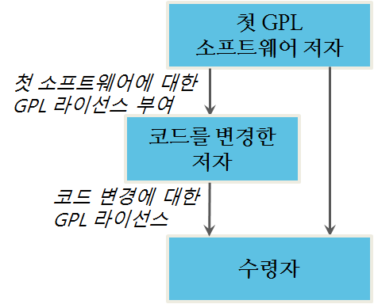

OSI (Open Source Initiative)는 60개가 넘는 오픈소스 라이선스를 승인했다. 일부는 오픈소스 라이선싱에 잘못으로 이점을 지적한다 - 각 제품마다 라이선스가 있는 독점적 라이선스에는 더 많다는 점에서 이상하다. 사실, 승인된 60개 이상 OSI 라이선스 중에서 일부만 널리 사용되고, 다수는 단순히 많이 사용되는 일부에 변형에 불과하다.

이해할 필요가 있는 라이선스는 다음과 같다:

- GPL
- LGPL
- 모질라/이클립스 (Mozilla/Eclipse)
- BSD
- MIT
- 아파치 2.0 (Apache 2.0)

오픈소스 라이선스에는 두가지 분류가 있다: 방임(permissive)과 카피레프트(copyleft). *방임 라이선스(permissive license)*는 매우 단순하다: 사용자가 고지 요구사항(notice requirement)만 준수하기만 하면 소프트웨어를 가지고 무엇을 하든 허락된다. 고지 요구사항을 준수하는 것이 복잡하지 않지만, 바이너리 배포에 대해서 구현에 관리적인 도전이 있을 수 있다. (고지하는 방법에 대한 자세한 사항에 대해서는 7장 고지 요구사항을 참조한다). 모든 오픈소스 라이선스처럼, 제품 품질보증없이 소프트웨어를 있는 그대로(AS-IS) 제공한다. 그래서 방임 라이선스는 다음과 같이 요약될 수 있다:

- 코드로 원하는 것을 무엇이든 할 수 있다.
- 본인 책임아래 사용한다.
- 저자를 인정해준다.

정말 많은 방임 라이선스가 있다. BSD와 MIT 같은 일부 대중적인 라이선스가 있고, 이에 기반한 수백종의 변종이 있다. 하지만, 모두 방임형이라, 일반적으로 동일한 방식으로 동작한다.

*카피레프트*는 이해하는데 좀더 도적적이다. 아주 간결하게 말해서, 카피레프트는 상기 언급된 것에 더해서 다음을 추가한다:

- 만약 바이너리로 배포한다면, 바이너리에 대한 소스코드를 이용가능하게 만들어야 한다.
- 코드를 입수한 것과 동일한 카피레프트 조건으로 소스코드를 공개해야 한다.
- 라이선스 권리행사에 추가적인 제약을 둘 수 없다.

카피레프트는 몇가지 범주로 나뉜다:

- 초강력 (AGPL)
- 강력 (GPL)
- 더 약한 (LGPL)
- 약한 (이클립스, MPL, CDDL)

강도는 카피레프트 요구사항을 맞추는 소프트웨어 범위와 관계된다. GPL이 가장 범위가 넓다; GPL은 GPL 코드가 포함된 어떤 프로그램도 GPL 코드만 포함해야 된다. 다른 라이선스는 좀더 좁게 선을 긋는다: LGPL은 다른 코드에 동적 링크를 허락하고, 이클립스 혹은 MPL같은 약한 카피레프트 라이선스는 이클립스와 MPL 코드가 그 자신 파일에 있기만 하면 어떤 유형의 통합도 허락한다.

AGPL은 초강력 카피레프트 라이선스로 불리지만, 범위 때문은 아닌데 GPL 범위와 AGPL 범위는 같다. 대신에 초강력이라고 불리는 이유는 AGPL은 코드가 배포되지 않는 일부 상황에 (소스코드 접근) 카피레프트 조건을 적용하기 때문이다.

### 오픈소스 라이선스 해부

오픈소스 라이선스는 조건부 저작권 라이선스다. (이것이 왜 문제가 되고 집행에 대한 법적인 영향에 대한 구체적인 분석은 5장 조건부 라이선싱을 참조한다.) 모든 오픈소스 라이선스는 제한 분야나 제약없이 저작권에 대한 모든 권리를 부여한다. 오픈소스 라이선스는 라이선스 행사에 대한 조건을 부과한다. 하지만, 만약 조건을 지킨다면 독점적 라이선스에 대한 방식으로, 사용 형태, 사용 장소, 사본 갯수 등에 대해서 제한이 없다. 이것을 균형감을 갖고 보기 위해서, 회사가 독점적 라이선스 범위내에 있는지 감사하도록 조언을 주는 산업이 있다는 점을 고려한다.예를 들어, IT 관리자가 한 회사에 사용자 숫자를 제한하거나 소프트웨어가 설치되는 컴퓨터 댓수를 제한하는 도구가 있다. 이것 중에 어떤 것도 오픈소스에는 필요가 없다 - 해야되는 모든 것은 조건을 따른 것이다. 독점적 소프트웨어 라이선스와 비교해서, 오픈소스 라이선스는 실질적으로 준수하기가 꽤 수월하다.

오픈소스 라이선스는 라이선스 허가자(licensor)에 대해서 어떤 의무도 담고 있지 않다. 라이선스 허가자는 라이선스 허가를 내주지만, 어떤 것도 약속하지 않는다. 또한 기술적으로 라이선스는 면허 허가를 받는 사람에 대해서 어떤 의무도 담고 있지 않고, 단지 라이선스 행사에 대한 조건만 담고 있다.

### 특허 라이선스 부여

일부 오픈소스 라이선스는 특허에 관한 조항을 담고 있다. 소프트웨어 특허가 오늘날처럼 널리 퍼져있지 않을 때 거슬러 올라가 첫번째 오픈소스 라이선스가 작성되었다. 특허대상(patentable subject matter)을 포함하는 것을 확인한 중대한 소송 이후에, (소프트웨어 시스템을 경유해 실행된 발명을 주장하는) 소프트웨어 특허와 비즈니스 방법 특허가 1990년대 미국에서 좀더 대중화되었다.

대부분에 오픈소스 라이선스는 두가지 유형의 특허 조항을 담고 있다: 라이선스와 방어종료(defensive provision) 조항.

(아파치 2.0, 이클립스, 모질라, GPL 3.0 같은) 일부 라이선스에서 라이선스 부여는 소프트웨어에 라이선스를 받아들인다. 만약 코드에 기여자가 코드에 특허를 갖고 있다면, 해당 기여자는 오픈소스 라이선스 행사를 가능하게 하도록 모든 코드 수령자에 특허 라이선스를 부여한다.

추가적으로, 고속 특허(express patent) 라이선스를 담고있는  거의 모든 오픈소스 라이선스도 또한 방어종료 조항을 갖고 있다. 만약 라이선스 피허가자가 특허를 주장하면, 라이선스 피허가자는 오픈소스 라이선스에 따라 권리를 잃을 수 있다.

이들 조항에 대한 자세한 사항은 13장 오픈소스와 특허에서 논의된다. 하지만, 여기서 오픈소스 라이선스에 피허가자는 어떤 특허권도 부여하지 않는다는 것을 주목하다 - 단지 라이선스 허가자만 할 수 있다. 라이선스는 계약이 아니고, 수락 메커니즘이 없고, 라이선스 피허가자에 대한 의무를 담고 있지 않기 때문에, 오픈소스에서는 상호 특허사용허가(cross-license) 혹은 그랜트-백(grant-back)이 없다. 조건(조건 중 하나는 방어종료 조항될 수 있다)을 포함하고 있지만, 의무는 포함하고 있지 않다.

### 직접 라이선싱(Direct Licensing)

오픈소스 라이선스는 직접 라이선싱 모형(Direct Licensing Model)이다 - 오픈소스 라이선스는 2차 라이선스를 부여하는 어떤 권한도 부여하고 있지 않다. 대신에 변경 혹은 변경되지 않은 코드의 재배포를 허가한다. 저자가 오픈소스 라이선스 아래 코드를 출시했을 때, 코드가 언제 어떤 방식으로 전달되는지 관계없이, 권리 부여가 자동으로 모든 수령자에게 이루어진다. 코드를 변경한 저자가 변경된 소프트웨어를 수령자에게 전달했는지 관계없이, 어떻게 권리부여가 흘러가는지 그림 3.1에 나와있다.

직접 라이선싱에 몇가지 보조정리가 있다. 만약 배포자가 오픈소스 라이선스를 위반하면, 설사 배포자 그 자신의 권리를 잃을 수 있지만, 후속 수령자는 그렇지 않는다. 이것이 그런 이유는 권리부여가 결코 처음부터 배포자부터 흘러내려가지 않기 때문이다. 후속 수령자가 라이선스를 위반하지 않는다면, 권리 부여는 영향을 받지 않는다.

더욱이, 오픈소스 라이선스는 결코 이전될 수 없다. GPL 버젼 3은 이점에 관해서 명확히 다음과 같이 언급하고 있다:

~~~ {.python}
An “entity transaction” is a transaction transferring control of an organization, or substantially all assets of one, or subdividing an organization, or merging organizations. If propagation of a covered work results from an entity transaction, each party to that transaction who receives a copy of the work also receives whatever licenses to the work the party’s predecessor in interest had or could give under the previous paragraph, plus a right to possession of the Corresponding Source of the work from the predecessor in interest, if the predecessor has it or can get it with reasonable efforts. 
~~~

하지만, 직접 라이선싱 모형을 이해하기만 하면, 이것은 명확하다. 만약 어떤 회사(구매자)가 또다른 회사(목표 회사)의 자산을 매입했고, 목표회사는 구매자에게 사용할 오픈소스 코드를 배달하고 나서, 거래가 완료된 후에, 구매자는 저자로부터 직접 코드에 대해서 자신의 라이선스를 행사한다. 라이선스는 결코 이전될 필요가 없는데 이유는 처음부터 모든 수령자(목표회사와 구매자를 포함)에게 부여되서 그렇다. 대조적으로 독점적 라이선스는 하나의 라이선스에서 또다른 라이선스로 이전되어야만 된다 - 이점이 인수합병(M&A) 거래에서 장애가 될 수 있다.

### 일반적인 오픈소스 라이선스

표 3.1에 가장 일반적인 오픈소스 라이선스 목록이 나와 있다. 부록 B 오픈소스 라이선스에 좀더 자세한 목록이 나와 있다.

표 3.1 가장 일반적인 오픈소스 라이선스

|	라이선스	|	영문명	|	카피레프트?	|	주석	|
|	---------------------------------------------	|	---------------------------------------------	|	---------------------------------------------	|	---------------------------------------------	|
|	아페로 GPL 3.0	|	Affero GPL 3.0	|	예	|	GPL 처럼 초강력 카피레프트, 하지만 소스코드 요구사항은 SaaS 사용에서 촉발됨.	|
|	아파치 소프트웨어 라이선스 (1.1)	|	Apache Software License (1.1)	|	아니요	|	아파치 1.0은 거의 더 이상 사용되지 않음; 버전 1.1 은 "광고" 조항을 삭제함.	|
|	아파치 라이선스 2.0	|	Apache License 2.0	|	아니요	|	방임 라이선스지만 BSD, MIT, 아파치 1.0보다 좀더 자세한 조건을 포함; 고속특허부여 포함.	|
|	예술적인 라이선스	|	Artistic License	|	아니요(하지만, 이점은 논쟁이 되었다)	|	카피레프트는 아니지만, 대부분의 방임 라이선스보다 제약이 더 많다. 이 라이선스 아래 많은 프로젝트는 GPL 아래 이중으로 사용허가되고 있다.	|
|	(신) BSD 라이선스	|	(New) BSD License	|	아니요	|	형식 라이선스(Template License) - 다수 변종이 사용된다. 주요 변종은 "3-항"과 "2-항" 변종이다. 초기 버전은 광고 문항을 포함했다.	|
|	부스트 라이선스	|	Boost License	|	아니요	|	부스트 프로젝트의 기반 라이선스로 많이 사용됨; 하지만, 부스트 프로젝트의 일부는 이것을 사용하지 않음.	|
|	일반 개발과 배포 라이선스	|	Common Developmet and Distribution License(CD이)	|	예	|	MPL에 기반. SUN 공중 라이선스(Public License)를 계승.	|
|	일반 공증 라이선스 1.0	|	Common Public License 1.0	|	예	|	IBM 공중 라이선스(Public License)를 계승. 이클립스 라이선스도 참조.	|
|	이클립스 공중 라이선스	|	Eclipse Public License 1.0	|	예	|	CPL을 계승	|
|	GNU 일반공중 라이선스(GPL) 버전 2	|	GNU General Public License (GPL) Version 2	|	예	|	가장 일반적으로 사용되는 라이선스. 강한 카피레프트. 리눅스 커널에 적용.	|
|	모질라 공중 라이선스 1.1 (MPL)	|	Mozilla Public License 1.1 (MPL)	|	예	|	약한 카피레프트. 파이어폭스 브라우져에 적용	|
|	MySQL(GPL+FLOSS 예외)	|	MySQL(GPL+FLOSS Exception)	|	예	|	GPL과 같으나 오픈소스 코드에 링크를 허용	|
|	모질라 공중 라이선스 2.0 (MPL)	|	Mozilla Public License 2.0 (MPL)	|	예	|	약한 카피레프트. 파이어폭스 브라우져에 적용	|
|	OpenSSL/SSLeay	|	OpenSSL/SSLeay	|	아니요	|	"공개된 버전 혹은 파생된 코드에 대한 라이선스와 배포 조건은 변경될 수 없다" 하자만 일반적으로 방임 라이선스로 이해되고 있다.	|
|	Sun 산업 표준 소스 라이선스(SIS니)	|	Sun Industry Standards Source License (SIS니)	|	예	|	사용중단; 이제 대략 CDDL로 대체됨. 자세한 정보는 [http://www.openoffice.org/FAQs/licensechange.html]( http://www.openoffice.org/FAQs/licensechange.html) 참조.	|
|	W3C 라이선스	|	W3C License	|	아니요	|	방임 라이선스. W3C는 표준화 단체임에 주목; 이 라이선스는 저작권 획득 가능 자료를 다루고, 표준은 다른 유형의 지적재산을 다룬다.	|
|	zlib/libpng 라이선스	|	zlib/libpng license	|	아니요	|	방임 라이선스	|

### GPL

GPL은 "자유 소프트웨어" 혹은 카피레프트 라이선스 원형이다. 일반적으로 가장 널리 사용되는 [오픈소스 라이선스][1]로 간주된다.

    [2]: 사용을 측정하는 방식은 많다. (다양한 자료로 측정) GPL은 대부분의 프로젝트에 적용된다. 하지만, 의심없이 사용량을 가중치 두고 측정하면 아파치 2.0, MIT, BSD 쪽으로 기울어 진다.

#### GPL 버젼

버젼 1.0 은 더이상 사용되지 않는다. 버젼 2.0 은 1991년 출시되었고 버젼 3.0 은 2007년 출시되었다.

라이선스 버젼을 매기는 것이 혼동스러울 수 있다. 일부 프로젝트가 단일 GPL 버젼 (리눅스 커널에 사용되는 GPL 버젼 2 처럼)으로 출시되지만, 대부분은 해당 버젼과 후속 버젼으로 출시된다. 해당 GPL 버젼 아래 코드를 받는 수령자는 (버젼 2) 라이선스 버젼 아래 코드를 사용할지 후속 버젼(현재 버젼 2 혹은 3)으로 사용할지 선택옵션을 갖는다. 

해당 버젼과 후속 버젼 아래 출시할 선택은 라이선스 관리에 큰 신의에 대한 징조가 된다. 만약 책임자가 라이선스 허가자에 덜 유리하게 후속 버젼을 발행하면, 라이선스 허가자 권리는 손상될 수 있다. 하지만, 이 쟁점은 해석적 요술로 처리된다 -  수령자가 임의 버젼으로 라이선스를 사용하더라도, 라이선스 허가자는 만들지 않는 어떤 라이선스 부여권리도 유지할 수 없다.   아마도 이것이 GPL 버젼 2에 대해서 가장 의미를 갖는 것으로 GPL 버젼 2는 어떤 고속 특허 라이선스도 담고 있지 않다. 이론적으로, 만약 저자가 GPL 버젼 2 아래 코드를 출시하면, 버젼 3에 특허 부여에 묶여있지 않게 된다. 하지만, 어떤 후속 버젼도 진실로 권리 부여를 추가하지 않고, 조건만 추가한다는 것이 이론이다. 

#### GPL 버젼 2 강독

GPL 버젼 2를 강독한 대부분의 사람은 저자에게 이해하기 힘들고 심지어 불가능하다고 불평한다. 사실, 그자체 언어가 이해하기 어려운 것은 아니지만, 구조가 그다지 도움이 되지 못한다. 물론, GPL과 극히 평범한 소프트웨어 라이선스 사이에 언어적으로 큰 차이가 있다. GPL 버젼 2는 평이한 언어로 초안을 작성하려고 노력했다 - 특히 기술 영역에 종사하는 많은 변호사가 선호하는 것.

라이선스 첫부분은 서문으로 대략 통상적인 라이선스 협약에 있는 설명에 대응된다. 계약 해석을 규율하는 법에 따라, 아마도 이부분은 라이선스 조건에 대한 부분이 아니라 해석적 배경으로 간주된다.

GPL 첫번째 문단은 1 대신에 0으로 번호가 시작한다. C같은 컴퓨터 프로그래밍 언어에서 서수 셈은 0으로 시작한다. 예를 들어, 배열 첫번째 요소는 0이다 - 많은 초보 코더가 밤을 새며 디버깅하게 만드는 관례다.

GPL 주요 조건은 세부분으로 구분된다: 변경되지 않는 소스코드 배포, 변경되지 않는 바이너리 배포, 변경된 코드 배포. 이점이 아마도 거의 이런 방식으로 작성되지 않는 종래 라이선스에 익숙한 사람에게 GPL 라이선스가 혼란을 만든다.

GPL 2 일부 조항은 다음과 같은 별명이 붙어있다:

- 5절은 "계약 아님(no contract)" 조항으로 GPL이 라이선스로 계약이 아님을 언급하고 있다.
- 7절은 "자유 혹은 죽음(Liberty or Death)" 조항으로 만약 수용자가 다른 제약없이 GPL 조건으로 코드를 배포하지 않는다면, 수용자는 코드를 절대로 배포할 수 없음을 언급하고 있다. 만약 예를 들어 GPL과 독점적 코드에 대한 라이선싱 조건, 혹은 GPL과 특허 라이선스 혹은 기밀유지 협약(Nondisclosure Agreemet, NDA) 사이에 충돌이 발생하면, 이 조항이 작동하게 된다. 

GPL은 관할법 조항이 없다. 빼먹은 것이 아니다 - 라이선스를 "국제화(internationalize)"하고, 그럼으로써 국가버젼 포킹을 금지하려는 의도가 있다. 변호사 대부분은 아무것도 없는 것보다 임의 법조항 선택을 고려할 수 있지만, GPL 기안하신 분은 결정을 내릴 때 확실성을 두고 지역법과 조화를 했다. 따라서, 바탕법이 지정되서 특정 사례에 GPL 해석을 위해서 어떤 주법 혹은 국가법이 사용될지 정한다.

#### "특별한 예외(Special Exceptions)"

일반적으로 GPL만 공식 형태로 나오지만, GPL에 일부 변형이 있다. 각각의 변형은 즉흥적으로 개발되었고, "특별한 예외(special exception)" 혹은 라이선스 허가자에 의해서 부여된 추가적인 허용의 형태를 띈다. 각각의 예외는 GPL 범위를 약화시킨다. 표 3.2에 가장 대중적인 것이 목록으로 나와 있다.

이러한 예외는  특이할 수 있다. 그래서 만약 예외가 적용되는 GPL 변형을 다룬다면, 매번 정독을 해야하고 매번 분석해야 된다.

표 3.2 GPL에 특벼한 예외

|	예외	|	사용처	|	의미	|
|---------------------------	| ---------------------------	|---------------------------	|
|	GCC 런타임 라이브러리 예외, [http://www.gnu.org/licenses/gcc-exception-3.1.html](http://www.gnu.org/licenses/ gcc-exception-3.1.html)	|	GNU C 컴파일러를 위한 C 런타임 라이브러리	|	어떤 "자격있는 컴파일 과정(Eligible Compilation Process)" 경유해 사용되는 런타임 라이브러리 사용에 대해서 모든 GPL 요구사항을 제거하는 폭넓은 예외	|
|	클래스경로(Classpath) 예외, [http://www.gnu.org/software/ classpath/license.html](http://www.gnu.org/software/classpath/license.html)	|	GNU Classpath 프로젝트(자바 라이브러리 재구현)과 Open J아	|	독점적 코드에 링킹을 허용. 어떤 유형의 링크도 허용하지만, 클래스경로 파일은 동적으로 링크될 것 같음에 주목한다.	|
|	FOSS/FLOSS 예외, [http://www.mysql.com/about/legal/licensing/foss-exception/](http://www.mysql.com/about/legal/licensing/foss-exception/)	|	MySQL 응용프로그램 인터페이스	|	(방임 라이선스 아래 코드를 포함해서) GPL 코드를 다른 오픈소스 코드에 링크를 허용. 이 예외는 시간에 따라 수정되었고 2012년에 가장 최신정보가 나왔다.	|

FOSS 예외를 제외하고, 다른 예외는 실질적인 조처로 개발도구(GCC), 언어엔진(Java)이 필요로 하는 런타임 라이브러리 라이선싱은 상응하는 응용프로그램이 GPL 아래 사용허락되는 것을 요구하지 않는다. 다른 말로, GCC로 혹은 Java 플랫폼에 돌아가는 독점적 응용프로그램을 개발할 수 있다는 것이다. 이러한 예외사항이 LGPL보다 더 방임적이라는데 주목한다. LGPL은 주로 (플러그인 처럼) 응용프로그램에 대해서 동적으로 링크된 라이브러리로서 해당 라이브러리가 사용될 수 있게 한다.

### 덜한 일반 공중 라이선스 (Lesser General Public License, LGPL)

