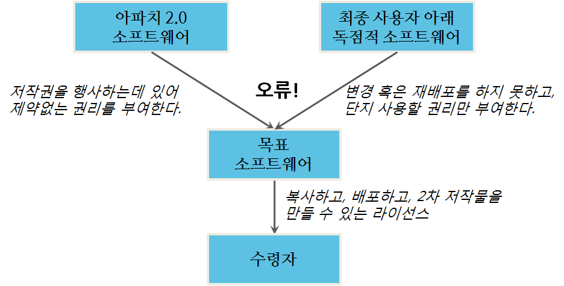
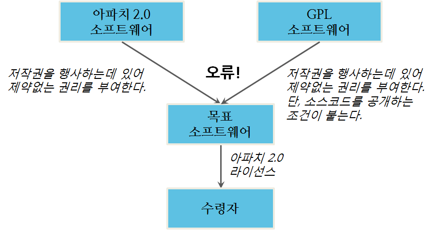
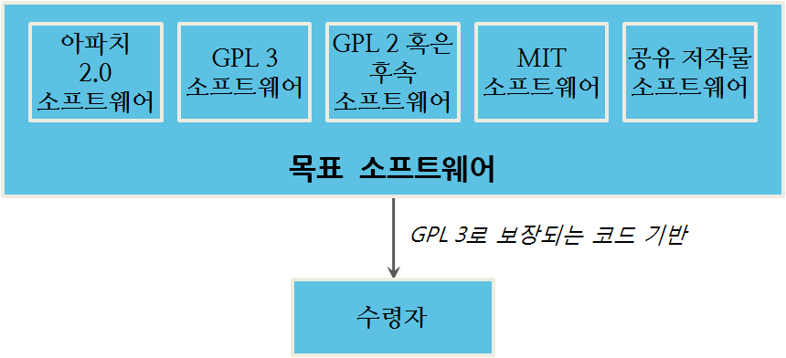
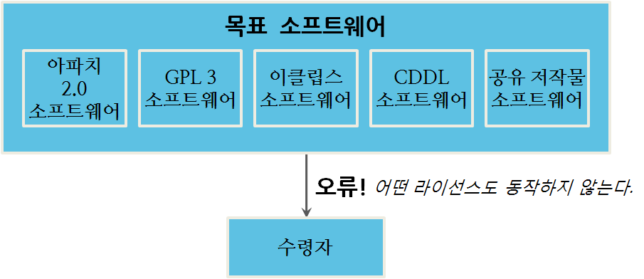

주의의무(due diligence)에 대한 필요와 라이선스 호환성에 대한 질문은 오픈소스 라이선싱을 벗어난다. 소프트웨어 라이선싱이 시작된 이래로, 변호사는 소프트웨어 라이선스 호환성에 대한 쟁점을 다루어왔다; 변호사 뿐만 아니라 모든 사람에게 호환성이 문제가 될 오픈소스 라이선싱에 의해서 이 쟁점이 중심에 서게 되었다. 이번 장에서 읽는 대부분의 정보는 일반적인 소프트웨어 라이센싱에 관한 것이고, 끝부분에 상당한 주의의무에 대해서 대부분의 문제를 일으키는 것은 오픈소스 라이선스가 아니라 독점적 라이선스라는 결론에 도달할 것이다.

### 어색한 저녁 파티

다른 유형의 소프트웨어로 개발하는 것은 마치 어색한 저녁 파티를 친척을 위해 준비하는 것과 같다. 상당한 노력을 중복해서 기울여 모두를 먹일 수 있다: 저탄수화물 식이요법 중인 중년 삼촌은 고기와 생선을 원하고; 채식주의자 여동생은 친환경 유기농 채소만 원하고; 사춘기 조카는 피자면 뭐든지 먹을 것이다. 하지만, 만약 석식 손님이 본인 식단을 제한할 뿐만 아니라 먹을 수 없는 모든 것에 대해서 분노와 역겨움을 숨긴다면 어떨까? 모든 이를 같은 식탁에 모시는 것은 어려울 것이다.

전세계 주요 뉴스를 장식하는 많은 것처럼, 이러한 문제는 참여자가 다르기 보다는 다른 사람과 공존을 거절하는 참여자로부터 나온다. 본인이 옳고 그밖의 모든 사람은 잘못되었다고 확신하는 사람처럼 소프트웨어 라이선스는 각각이 본인만의 규칙을 갖고 있다. 모든 규칙이 충돌날 때, 공존은 불가능할 수 있다.

### 주의의무(Due Diligence)란 무엇인가?

오픈소스 라이선싱을 배우려는 사람 대부분은 상당한 주의를 해야하는 목표를 갖고 있다. 이 과정은 다른 많은 명칭이 있다 - 감사(audit), 주의의무(due diligence), 관리업무(housekeeping), 준법준수(compliance), 위생(hygiene). 하지만, 어떤 명칭으로 불리던, 몸담고 있는 조직이 사용하는 소프트웨어가 다루는 오픈소스 라이선스를 준수하고 있다는 것을 확실히 하는 과정이다. 저자는 이 과정을 줄여 *주의의무(diligence)* 라고 부른다.

주의의무 프로젝트는 많은 이유로 일어난다. 거의 항상, 기업거래 과정에서 불거져 나온다 - 인수, 합병, 기업분할, 자금조달 거래. 하지만, 고객의 요구, 규제당국 감사, 혹은 단순하게는 위험을 관리하거나 다른 사람의 지적재산을 존중하려는 올바른 일을 하는데 라이선스를 준수하려는 시도로 시작되기도 한다. 

주의의무 과정은 완벽함에 대한 것이 아니다: 위험관리에 대한 것이다. 완벽한 준수 같은 것은 존재하지 않는다; 단순한 제품 혹은 사업에 조차도 소프트웨어를 둘러싼 풍경은 완벽한 준수를 하기에는 너무 복잡하다. 주의의무 과정은 먼저 가장 최악의 문제를 해결하려고 설계되었고 그리고 나서 다음 고약한 문제로 옮겨가고, 그리고 나서 다음 문제로 옮겨가는데 이 과정은 시간, 에너지, 위험에 대한 공포가 고갈될 때까지 계속된다. 문제를 분류하고 합리적인 결정을 내리는 과정이다.

 지배적인 관점으로부터, 주의의무는 *들어오는(inbound)* 권리가 *나가는(outbound)* 권리와 같거나 혹은 더 큰 것을 확실히 하는 과정이다. *들어오는(inbound)*는 회사에 부여되는 라이선스를 의미하고, *나가는(outbound)*는 회사가 행사하는 혹은 다른 곳에 부여되는 권리를 의미한다. 만약 갖고 있는 것 보다 많은 권리를 부여하거나 사용한다면, 누군가의 권리를 침해하고 있는 것이다.

그림 4.1 인입되는 권리 승인을 통제하는 두 가지 일반적인 경우

그림 4.1 에는 소프트웨어 코드 베이스 (즉, 인입되는 권리)에 인입되는 권리 승인을 통제하는 두가지 일반적인 사례가 나와 있다. 하나는 당사자가 목표 소프트웨어를 생성하려고 작성되는 소프트웨어다. 저자로, 해당 당사자는 저작권을 행사할 권리를 갖는다. 또다른 군성요소는 다른 사람이 작성한 소프트웨어다 - 따라서 저작권을 행사하는데 라이선스가 필요하다 - 하지만, 폭넓게 인입되는 라이선스 아래 제공된다. 인입되는 각 경우가 충분히 수령자에게 라이선스를 주는 권리(나가는 권리를 의미)를 정리할 수 있게 한다.  나가는 권리가 인입되는 권리보다 작거나 같기만 하면, 라이선싱은 정상 동작한다.

#### 잠재적 주의의무 쟁점

권리 정리와 관련된 문제는 많은 형태로 표출되지만, 라이선스 제약과 라이선스 조건이 가장 흔하다. 라이선스 제약은 독점적 라이선싱에만 일어난다; 라이선스 조건이 오픈소스 라이선싱에 좀더 흔한 쟁점이다.

그림 4.2 라이선스 제약 문제

그림 4.2 는 독점적 라이선싱에서 본질적인 주의의무(quintessential diligence) 문제를 묘사하고 있다. 독립적인 소프트웨어에 대한 인입되는 라이선스 범위는 외부로 나가 부여되는 범위보다 좁아진다; 외부로 부여되는 권리의 일부가 인입되는 라이선에서 부여되어 있지 않다. 물론, 이런 문제는 오픈소스 소프트웨어에는 일어날 수 없는데 이유는 오픈소스 정의 자체가 라이선스 부여에 대한 어떤 제한도 두고 있지 않기 때문이다. 하지만, 그림 4.3 에 보여주듯이, 오픈소스 라이선스도 주의의무 문제를 생성하는 조건을 부과할 수 있다.

그림 4.3에서 소프트웨어 코드 기반에는 GPL을 포함하는 인입되는 라이선스 컴포넌트를 포함되어 있다. GPL은 카피레프트 라이선스기 때문에, 소프트웨어를 재배포할 때 카피레프트 라이선스 조건을 따라야만 된다. 하지만, 여기에 실수가 있다; 이런 조건이 수령자에게 흘러 내려갈 수는 없다. 이것이 본질적인 오픈소스 주의의무 문제가 된다. 이를 달리 표현하면 인입되는 라이선스로 GPL은 나가는 라이선스로 아파치와 호환될 수 없다.

그림 4.3 라이선스 조건 문제

오픈소스 소프트웨어에서, 조건의 충돌은 많은 주의의무 문제를 만들어 낸다. 상기 그림에서 목적 코드를 개발한 회사가 문제를 해결하려면 외부로 나가는 라이선스를 GPL로 변경해야 할 것이다. 올바르게 라이선싱이 동작하는 소프트웨어를 만들어 내려면, 외부로 나가는 라이선스와 호환가능한 인입 라이선스만을 사용할 필요가 있다. 따라서, 외부로 나가는 라이선스와 비교해서, 더 적은 일관된 조건을 갖는 인입 라이선스만 사용해야 한다. 오픈소스 세계에서 이러한 점이 호환성에 관해서 얘기할 때, 의미하는 것은 이런 것이다.

그림 4.4 예제에서, GPL3와 호환되는 많은 라이선스가 해당 프로젝트를 통제할 수 있다. 기본 규칙은 외부로 나가는 라이선스는 최대한 조건을 갖는 라이선스가 되야 한다.

그림 4.4 라이선스 호환성

하지만, AGPL (더 많은 조건을 보유), 이클립스 공증 라이선스, 혹은 CDDL (모두 다른 카피레프트 조건을 보유) 같은 라이선스로 통제되는 구성요소는 상기 소프트웨어에 포함될 수 없다. 이 모든 카피레프트 라이선스는 어색한 저녁 파티에 손님과 같다 - 각자의 식단은 상호 배타적이다. 이런 이유는 라이선스 모두 소프트웨어 추가적인 라이선싱 제약을 두는 것을 거부하기 때문이다. 또한, 각각은 약간 다른 조건을 담고 있어서, 각 라이선스는 다른 것에 대하여 부가적인 제약을 구성하고 있다. 예를 들어, GPL 2 6절에서 다음과 같이 언급하고 있다:

~~~ {.python}
Each time you redistribute the Program (or any work based on the Program), the recipient automatically receives a license from the original licensor to copy, distribute or modify the Program subject to these terms and conditions. You may not impose any further restrictions on the recipients’ exercise of the rights granted herein.
~~~

일부 카피레프트 라이선스는 호환된다. 예를 들어, LGPL 코드는 GPL 상응하는 버젼 아래 재배포될 수 있는데 이유는 GPL이 아닌(non-GPL) 소프트웨어와 특정 유형의 통합을 가능하게 하도록 단지 LGPL이 부가적인 허락을 담고 있기 때문이다. LGPL 버젼 3에는 이점이 더 명확하다. LGPL 3이 GPL 3에 추가적인 조건을 넣어 초안을 작성했기 때문이다; 대응되는 LGPL 버젼 2에 대해서, LGPL 2.1 버젼 3절에는 이를 허용하는 구체적인 조항이 담겨있다:

~~~ {.python}
You may opt to apply the terms of the ordinary GNU General Public License instead of this License to a given copy of the Library. …
Once this change is made in a given copy, it is irreversible for that copy, so the ordinary GNU General Public License applies to all subsequent copies and derivative works made from that copy. This option is useful when you wish to copy part of the code of the Library 
into a program that is not a library.
~~~

상기 논의는 저자가 생각하는 수직 호환성(vertical compatibility)과 관계된다; 인입되는 라이선스가 주어진 상태에서, 인입 라이선스로 보장된 소프트웨어는 종합적으로 외부로 나가는 또다른 라이선스가 보장하는 코드 기반으로 재배포할 수 있는가? 하지만, 오픈소스 라이선싱은 2차 라이선싱 영역에 있지 않음을 명심한다. 인입 라이선스 조건은 변하지 않는다; 실제로 모든 수령자에게 직접 간다. 하지만, 오픈소스에서 저작권 모든 권리가 부여되서, 부여되는 권리 사이에는 어떤 불일치도 있을 수 없다; 유일한 차이는 라이선스 행사에 부여된 조건이다. 따라서, 인입되는 라이선스와 외부로 나가는 라이선스의 조건이 상호 배타적이지만 않으면, 호환성 문제는 없다.

#### "수평" 호환성(Horizontal Compability) 쟁점

하지만, 저자가 수평 호환성으로 간주하는 좀더 미묘한 쟁점이 있다. 이 쟁점은 GPL과 LGPL 아래서만 일어난다. 왜냐하면, GPL과 LGPL만이 코드가 통합될 수 있는 방법에 대한 제한을 두는 라이선스이기 때문이다. GPL과 LGPL 준수에 대해서 8장과 9장에서 좀더 자세히 다루지만, 현재로는 짧은 규칙은 다음과 같다:

- 프로그램에 어떤 코드가 GPL이면, 모든 코드는 GPL로 제공되어야만 된다.
- LGPL 코드는 프로그램에 다른 코드와 동적 링크 라이브러리(Dynamically linked library)로만 통합될 수 있다.

그림 4.5 수평 비호환성 때문에 발생한 문제

