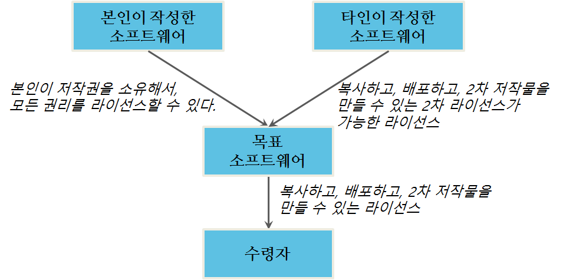

주의의무(due diligence)에 대한 필요와 라이선스 호환성에 대한 질문은 오픈소스 라이선싱을 벗어난다. 소프트웨어 라이선싱이 시작된 이래로, 변호사는 소프트웨어 라이선스 호환성에 대한 쟁점을 다루어왔다; 변호사 뿐만 아니라 모든 사람에게 호환성이 문제가 될 오픈소스 라이선싱에 의해서 이 쟁점이 중심에 서게 되었다. 이번 장에서 읽는 대부분의 정보는 일반적인 소프트웨어 라이센싱에 관한 것이고, 끝부분에 상당한 주의의무에 대해서 대부분의 문제를 일으키는 것은 오픈소스 라이선스가 아니라 독점적 라이선스라는 결론에 도달할 것이다.

### 어색한 저녁 파티

다른 유형의 소프트웨어로 개발하는 것은 마치 어색한 저녁 파티를 친척을 위해 준비하는 것과 같다. 상당한 노력을 중복해서 기울여 모두를 먹일 수 있다: 저탄수화물 식이요법 중인 중년 삼촌은 고기와 생선을 원하고; 채식주의자 여동생은 친환경 유기농 채소만 원하고; 사춘기 조카는 피자면 뭐든지 먹을 것이다. 하지만, 만약 석식 손님이 본인 식단을 제한할 뿐만 아니라 먹을 수 없는 모든 것에 대해서 분노와 역겨움을 숨긴다면 어떨까? 모든 이를 같은 식탁에 모시는 것은 어려울 것이다.

전세계 주요 뉴스를 장식하는 많은 것처럼, 이러한 문제는 참여자가 다르기 보다는 다른 사람과 공존을 거절하는 참여자로부터 나온다. 본인이 옳고 그밖의 모든 사람은 잘못되었다고 확신하는 사람처럼 소프트웨어 라이선스는 각각이 본인만의 규칙을 갖고 있다. 모든 규칙이 충돌날 때, 공존은 불가능할 수 있다.

### 주의의무(Due Diligence)란 무엇인가?

오픈소스 라이선싱을 배우려는 사람 대부분은 상당한 주의를 해야하는 목표를 갖고 있다. 이 과정은 다른 많은 명칭이 있다 - 감사(audit), 주의의무(due diligence), 관리업무(housekeeping), 준법준수(compliance), 위생(hygiene). 하지만, 어떤 명칭으로 불리던, 몸담고 있는 조직이 사용하는 소프트웨어가 다루는 오픈소스 라이선스를 준수하고 있다는 것을 확실히 하는 과정이다. 저자는 이 과정을 줄여 *주의의무(diligence)* 라고 부른다.

주의의무 프로젝트는 많은 이유로 일어난다. 거의 항상, 기업거래 과정에서 불거져 나온다 - 인수, 합병, 기업분할, 자금조달 거래. 하지만, 고객의 요구, 규제당국 감사, 혹은 단순하게는 위험을 관리하거나 다른 사람의 지적재산을 존중하려는 올바른 일을 하는데 라이선스를 준수하려는 시도로 시작되기도 한다. 

주의의무 과정은 완벽함에 대한 것이 아니다: 위험관리에 대한 것이다. 완벽한 준수 같은 것은 존재하지 않는다; 단순한 제품 혹은 사업에 조차도 소프트웨어를 둘러싼 풍경은 완벽한 준수를 하기에는 너무 복잡하다. 주의의무 과정은 먼저 가장 최악의 문제를 해결하려고 설계되었고 그리고 나서 다음 고약한 문제로 옮겨가고, 그리고 나서 다음 문제로 옮겨가는데 이 과정은 시간, 에너지, 위험에 대한 공포가 고갈될 때까지 계속된다. 문제를 분류하고 합리적인 결정을 내리는 과정이다.

 지배적인 관점으로부터, 주의의무는 *들어오는(inbound)* 권리가 *나가는(outbound)* 권리와 같거나 혹은 더 큰 것을 확실히 하는 과정이다. *들어오는(inbound)*는 회사에 부여되는 라이선스를 의미하고, *나가는(outbound)*는 회사가 행사하는 혹은 다른 곳에 부여되는 권리를 의미한다. 만약 갖고 있는 것 보다 많은 권리를 부여하거나 사용한다면, 누군가의 권리를 침해하고 있는 것이다.

그림 4.1 인입되는 권리 승인을 통제하는 두 가지 일반적인 경우

 그림 4.1 에는 소프트웨어 코드 베이스 (즉, 인입되는 권리)에 인입되는 권리 승인을 통제하는 두가지 일반적인 사례가 나와 있다. 하나는 당사자가 목표 소프트웨어를 생성하려고 작성되는 소프트웨어다. 저자로, 해당 당사자는 저작권을 행사할 권리를 갖는다. 또다른 군성요소는 다른 사람이 작성한 소프트웨어다 - 따라서 저작권을 행사하는데 라이선스가 필요하다 - 하지만, 폭넓게 인입되는 라이선스 아래 제공된다. 인입되는 각 경우가 충분히 수령자에게 라이선스를 주는 권리(나가는 권리를 의미)를 정리할 수 있게 한다.  나가는 권리가 인입되는 권리보다 작거나 같기만 하면, 라이선싱은 정상 동작한다.

#### 잠재적 주의의무 쟁점

